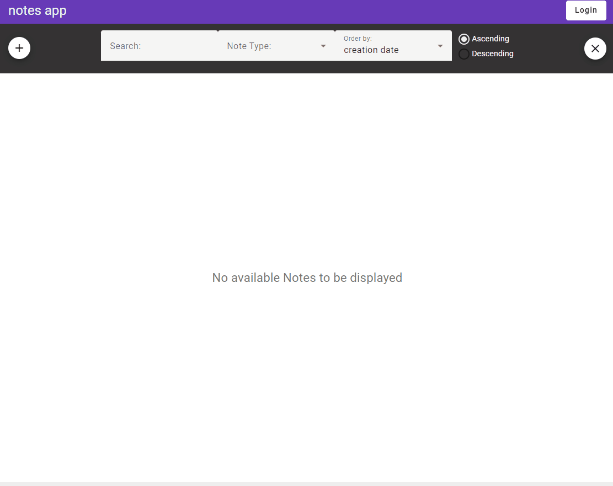

# Notesapp

This angular project contains a solution for the Cocus FrontEnd challenge, consisting of a multi user note creation and sharing platform.

The app is used to create and share notes.
Notes are simple pieces of data containing a title, a type, some markdown content and one image.
Notes can be acessed directly on the UI (clicking a card), or by url.



## Access

Note creation and changes are implemented on 2 access levels, **public** and **private**:

- new notes created by unregistered users are **public**;
- - **public** notes can be changed or deleted by both **registered** and **unregistered** users;
- - **public** notes cannot be shared with anyone in particular since they are already shared with everybody; 

- new notes created by logged in users are **private**
- - **private** notes can only be changed by their owners (users who created them);
- - **private** notes can be shared with other registered users;
- - registered users can **view** notes that were shared with them, but they cannot change them;

When the app is ran for the first time, the user will be logged out, so he will only be able to access **public** notes.
Once a user logs in, he will be able to see and access: 
- all public notes;
- notes created by him;
- notes that were specifically shared with him by other users;

Logged in users can use the **Access Type** filter to include or exclude notes with this types of access, from the results in the grid list.

## UI

the UI consists of a simple panel displaying a filter bar and a grid style list containing all notes.
- there is a button to **login** / **logout** in the top right corner;
- there is a button to **add notes** in the top left corner, under the title;
- there is a button to **clear the filter selection** in the top right corner, under the login/logout button;

The list of notes can be **filtered** by:
- name or content text match
- note type ('Reminder', 'Todo', 'Contact')
- note access (only displayed for logged in users)

The list of notes can be **sorted** ascendingly and descendingly by:
- the note creation date
- the date and time of the last update on the note
- the note title
- the note content

## Reset

When the project is started, a "reset" script is run to ensure that "back end" data is available as a starting point.
The reset script creates: 
- 4 registered users: 'jon', 'paul', 'peter' and 'mary' 
- 3 note records per user
- 3 additional public notes records

The 4 users that are registered in the database all have the same password: 'password'. For convenience, a button was added in the login for each user to quickly load his credentials into the log in fields.

One important detail to keep in mind is that all note related data is only written to localStorage once, and only if the 'appnotes_data' key **does not** exist in the browser's localStorage.

User related data is always overwritten to localStorage using the key 'appnotes_users'.

## Features
- Add Encryption to the notes before storing. _all data is encrypted in and out fom localStorage using the **EncryptionService**_ 
- Add a Docker File. _a docker file was included to containerize the app and its dependencies. instructions in the reference bellow_
- Add Markdown Support. _the content of the note, when viewed, is displayed using markdown rendering_
- Add Multiuser Support. _multiuser support is implemented using 4 users as examples. each can create his own notes who are accessible only to them_
- Add note sharing between users. _note sharing between registered users is implemented, by simply editing the note to be shared and checking the boxes of the users to share with_
- Add note tagging or grouping. _note tagging or grouping is implemented as the 'Note Type' abstraction, that allows the user to filter notes by their types_
- Add possibility to link notes. _when viewed, each note displays a link that can be used to access it though a url. Accessing notes through a link, will still require users to have access either by ownership or sharing, otherwise the note content is not displayed_
- Add versioning of notes. _each time a note is updated, a new version of it is created. This version can then be loaded back again. This is done by editing a note and clicking a **revision** link from the revisions list._
- Filter notes in list view. _as described above, note results can be filtered by: note text content, note type, and access type._
- Insert images into notes. _an image may be added to a note when creating or editing it._
- Search notes. _as described above, note results can be filtered by note text content, using the **search** field of the top bar._
- Sort notes in list view. _as described above, note result sorting is implemented on 4 parameters and 2 directions._


## Data structures
The following data models are used to store the required information in the browser's local storage. This **types** and **interfaces** are defined in the files of the '/types' folder.

```
localStorage('notesapp_users') = [
    { userId: 1, username: 'jon', password: 'password' },
    { userId: 2, username: 'paul', password: 'password' },
    { userId: 3, username: 'peter', password: 'password' },
    { userId: 4, username: 'mary', password: 'password' },
];
```

```
localStorage('notesapp_data') = [
    {
        noteId: number;
        userId?: number;
        version: number;
        content: [
            title: string;
            content: string;
            imgUrl?: string;
            noteType?: 'reminder' | 'todo' | 'contact';
            sharing: number[];
            updated: Date;
        ];
        active: boolean;
        created: Date;
    }
]
```

## STACK
- Node 20.11.1
- Angular 17.3.0
- Deps:
- - material ui
- - ngx markdown
- - crypto js


## Commands
#### start the app in dev mode
```
ng s
```

#### build the app
```
ng build
```

#### create Docker image
```
docker build -t notesapp .
```

#### run the docker container
```
docker run -p 4200:4200 notesapp
```

_[diogo.moreda&#64;gmail.com](mailto:diogomoreda@gmail.com?subject=Cocus%20Test%20Feedback&body=Your%20Message)_ 2024